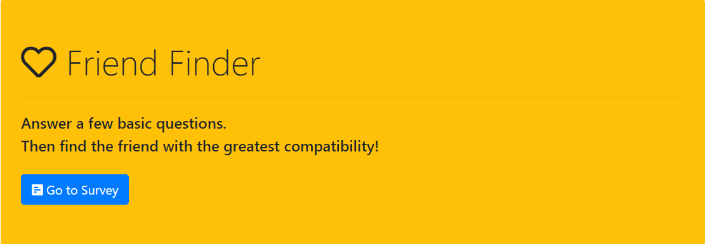

# FriendFinder


### Overview

"FriendFinder" is a full-stack compatibility-based application. It takes in results from users' surveys, then compares their answers with those from other users. The app then displays the name and picture of the user with the best overall match.

We use Express to setup routing and deployed app to Heroku. [**Try it out here**](https://nameless-river-63958.herokuapp.com).

**Home Page**


**Survey Page**


**Result Page**


### How App is Structured
 
We require two npm packages for this app `express` and `path` in `server.js` file. 

In `htmlRoutes.js` we set up two routes: a GET Route to `/survey` which displays the survey page and a default route that leads to `home.html` which displays the home page. 

Inside of `apiRoutes.js` we also set up two routes: a GET route with the url `/api/friends`. This will be used to display a JSON of all possible friends. And a POST route `/api/friends`. This will be used to handle incoming survey results. This route will also be used to handle the compatibility logic.
 
We save application's data inside of `app/data/friends.js` as an array of objects. Each object has this format: 

```json
{
  "name":"Ahmed",
  "photo":"https://test.jpg",
  "scores":["1", "2", "3", "4", "5", "5", "3", "2", "1", "3"]
}
```

We also create a `.gitignore` file and include node_modules, .DS_Store and .env. files there. By doing this we'll tell git to ignore node_modules folder when commiting and pushing files to the repository. 


### How App Works

The survey consists of 10 questions. Each answer is on a scale of 1 to 5 based on how much the user agrees or disagrees with a question.

We determine the user's most compatible friend using the following logic. We compare the difference between current user's scores against those from other users, question by question. Add up the differences to calculate the `totalDifference`. We use the absolute value of the differences. The closest match will be the user with the least amount of difference.

     * Example:
       * User 1: `[5, 1, 4, 4, 5, 1, 2, 5, 4, 1]`
       * User 2: `[3, 2, 6, 4, 5, 1, 2, 5, 4, 1]`
       * Total Difference: **2 + 1 + 2 =** **_5_**

Once it finds the current user's most compatible friend, the app displays the result as a modal pop-up with the name and picture of the closest match.

